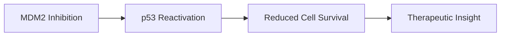
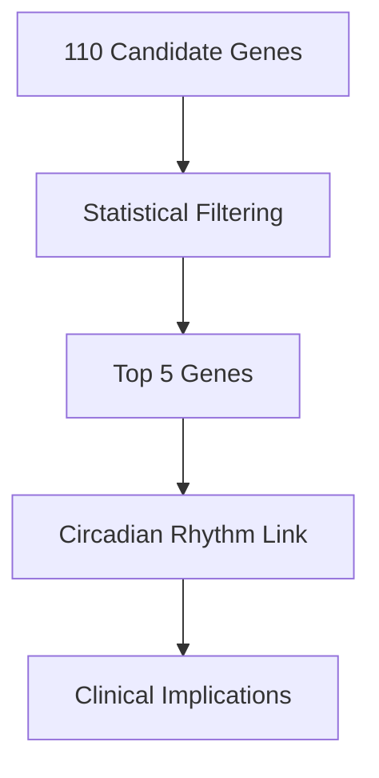
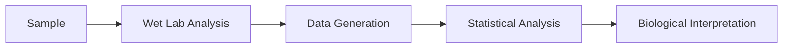
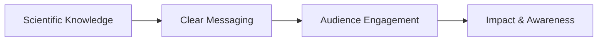

# Ayushi Vaghela

Medical Biosciences (Genetics) | Science Communication | Medical & Healthcare Content

> *Science is only half the story. The other half is how you say it.*

##  About Me

I am an MSc Medical Biosciences (Genetics) graduate with a strong foundation in **molecular biology, cancer research, and data analysis**, paired with hands-on experience in **medical writing, healthcare content editing, and science communication**.

My work sits at the intersection of **research, communication, and impact**. I translate complex biomedical concepts into content that is **clear, evidence-driven, and accessible** to clinicians, researchers, and the public.

## 🧠 Core Focus Areas

* **Medical & Healthcare Writing**
  Evidence-based articles, condition explainers, patient-facing content

* **Scientific Research & Evaluation**
  Critical appraisal, literature synthesis, translational insight

* **Cancer & Genetics**
  Molecular pathology, targeted therapeutics, radiotherapy side effects

* **Science Communication**
  Public engagement, editorial clarity, educational storytelling

---

## 🔬 Research Portfolio

### 1. MDM2 Inhibitors in Mature Lymphoid Malignancies

Master’s Dissertation | University of Leicester

**Objective:** Evaluate the efficacy of MDM2 inhibitors (AMG232, ASTX295, Idasanutlin) in cancer cell survival.

**Methods:**

* CellTiter-Glo (CTG) assays
* Comparative drug response analysis
* Data interpretation & statistical validation

**Key Insight:**
ASTX295 demonstrated the strongest reduction in cancer cell viability, highlighting its therapeutic potential.

---

### 2. Identifying Genes Causing Side-Effects Post-Radiotherapy in Breast Cancer

Year 3 Dissertation | Distinction

**Objective:** Identify genetic contributors to adverse radiotherapy side effects.

**Approach:**

* Bioinformatics-driven gene prioritisation
* Tools: GTEx, LocusZoom, STRING, Cytoscape
* Statistical filtering of 110 genes → Top 5 candidates

**Key Finding:**
Strong association with **circadian rhythm pathways**, reinforcing the importance of treatment timing in precision medicine.

---

### 3. T Cell Density and Function in Patient-Derived Explants

Research Project | University of Leicester

* Tumour immunology focus
* Functional assessment of immune response
* Translational relevance to cancer therapeutics

---

## 🧪 Laboratory & Technical Expertise

* Molecular cloning (pUC19, restriction enzymes)
* PCR, gel electrophoresis
* CRISPR-Cas9 (certified)
* Immunohistochemistry (Ki-67, E-cadherin, β-catenin, VEGF)
* Proteomics (Hsp90, LC-MS)
* GraphPad Prism (t-tests, ANOVA)

---

## ✍️ Medical Writing & Editorial Experience

### Healthcare Content Editing

**Klarity Health – Medical Content Intern**

* Edited evidence-based healthcare articles
* Ensured clinical accuracy and clarity
* Simplified complex conditions for patient understanding

**Example Topics:**

* Rare genetic syndromes
* Disease etiology & risk factors
* * Patient-friendly medical explanations

#### Published Medical Articles

Below is a selection of medical articles I reviewed for Klarity Health's Health Library:

- [Etiology of Fryns Syndrome: Understanding the Genetic Causes and Risk Factors Associated with Fryns Syndrome](https://my.klarity.health/etiology-of-fryns-syndrome-understanding-the-genetic-causes-and-risk-factors-associated-with-fryns-syndrome/)
- [Prolactinoma: Diagnosis and Treatment](https://my.klarity.health/prolactinoma-diagnosis-and-treatment/)
- [Surgical Debridement in Fournier Gangrene](https://my.klarity.health/surgical-debridement-in-fournier-gangrene/)
- [Causes of Uterine Fibroids](https://my.klarity.health/causes-of-uterine-fibroids/)
- [Why Behaviour Change Is Still Essential on GLP-1s](https://my.klarity.health/why-behaviour-change-is-still-essential-on-glp-1s/)
- [Primary vs. Secondary Causes of Hormonal Imbalance](https://my.klarity.health/primary-vs-secondary-causes-of-hormonal-imbalance/)
- [How Do ARBs Compare to ACE Inhibitors in Terms of Effectiveness for Heart Enlargement?](https://my.klarity.health/how-do-arbs-compare-to-ace-inhibitors-in-terms-of-effectiveness-for-heart-enlargement/)
- [Early-Stage Metastatic Breast Cancer](https://my.klarity.health/early-stage-metastatic-breast-cancer/)

#### University Open Day Experiential Map

I designed a minimalistic experiential map for the University of Leicester Open Day, researching numerous undergraduate courses to curate sessions and following the university’s branding guidelines. The map acts as a concise itinerary to help prospective students navigate the campus and discover programs of interest.

- Conducted research on a variety of undergraduate programmes to tailor content to prospective students’ interests.
- Designed a clean, minimalistic layout consistent with University of Leicester branding.
- Included essential information such as session timings and key locations to help visitors navigate the Open Day.
- Provided both digital and printed versions to enhance accessibility.

[View the Open Day map template](./Final%20template%20Criminology.pptx)

---

## 📣 Science Communication & Outreach

### Brand Ambassador Roles

GSK | AstraZeneca

* Promoted scientific careers and industry opportunities
* Designed posters, leaflets, and digital assets (Canva)
* Delivered presentations and hosted events (50+ attendees)
* Collaborated with STEM societies and university departments

---

## 🧩 Additional Professional Experience

### LabCup Technician – University of Warwick

* Operated in a regulated laboratory environment
* Chemical inventory management
* Compliance, health & safety, GDPR training

### Patient Simulation & Careers Projects

* Educational content development
* Student engagement and training support
* Translating technical information into practical guidance

---

## 🛠 Tools & Platforms

* GraphPad Prism
* Cytoscape, STRING, GTEx
* Canva, Piktochart, Adobe
* Wix (website building)
* Microsoft Office & Google Workspace

---

## 🌍 What I’m Looking For

Roles at the intersection of:

* **Medical writing & editing**
* **Science communication & publishing**
* **Healthcare content & education**

I am particularly interested in opportunities where **scientific accuracy, clarity, and real-world impact** matter.

---

## 📬 Contact

* **Email:** [ayushivaghela18@gmail.com](mailto:ayushivaghela18@gmail.com)
* **LinkedIn:** linkedin.com/in/ayushi-vaghela-076741214

---

*This portfolio reflects my academic training, professional experience, and commitment to translating science into meaningful communication.*
