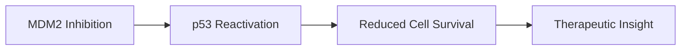
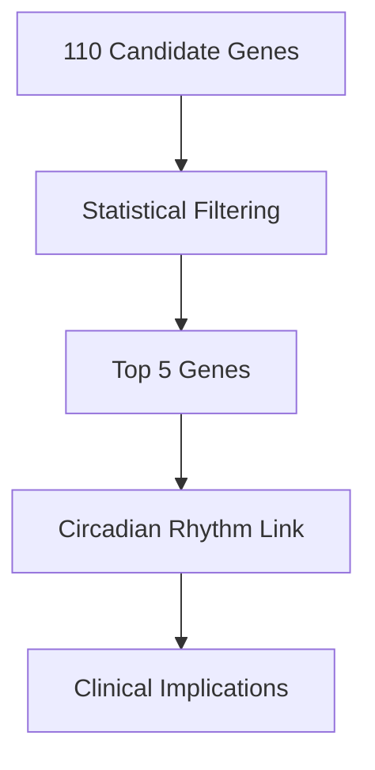
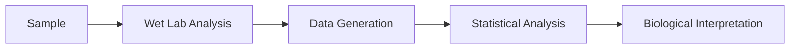
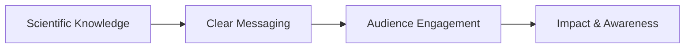

# Ayushi Vaghela

Medical Biosciences (Genetics) | Science Communication | Medical & Healthcare Content

> *Science is only half the story. The other half is how you say it.*

##  About Me

I am an MSc Medical Biosciences (Genetics) graduate with a strong foundation in **molecular biology, cancer research, and data analysis**, paired with hands-on experience in **medical writing, healthcare content editing, and science communication**.

My work sits at the intersection of **research, communication, and impact**. I translate complex biomedical concepts into content that is **clear, evidence-driven, and accessible** to clinicians, researchers, and the public.

## Highlights

- Edited and reviewed multiple medical articles weekly for Klarity Health, ensuring clinical accuracy, structure, and readability.
- Led the University of Leicester Open Day journey map project from concept through research, content planning, design, and final delivery.
- Extensive research background in molecular biology, cancer research, and genetics, translating complex data into clear, evidence-driven narratives.

## Skills & Competencies

### Editorial & Communication
- Medical and healthcare writing and editing
- Structural and line editing for clarity and flow
- Fact-checking and citation verification
- Adapting tone for patient and professional audiences

### Scientific & Research
- Critical appraisal and literature synthesis
- Translational insight across oncology, genetics, and immunology
- Experimental design and data analysis

### Tools & Platforms
- GraphPad Prism, Cytoscape, STRING, GTeX
- Canva, Piktochart, Adobe suite
- Microsoft Office and Google Workspace
- WordPress and basic SEO for web content

## 🧠 Core Focus Areas

* **Medical & Healthcare Writing**
  Evidence-based articles, condition explainers, patient-facing content

* **Scientific Research & Evaluation**
  Critical appraisal, literature synthesis, translational insight

* **Cancer & Genetics**
  Molecular pathology, targeted therapeutics, radiotherapy side effects

* **Science Communication**
  Public engagement, editorial clarity, educational storytelling

--
## 📝 Medical Editing & Writing

I edit and review evidence-based medical content for digital health platforms, ensuring clinical accuracy, clarity, and audience-appropriate communication across patient- and professional-facing materials.

  

    <h4>Etiology of Fryns Syndrome</h4>
    
Genetics Patient Education

    
<a href="https://my.klarity.health/etiology-of-fryns-syndrome-understanding-the-genetic-causes-and-risk-factors-associated-with-fryns-syndrome/">View article →</a>

  

  

    <h4>Prolactinoma: Diagnosis and Treatment</h4>
    
Endocrinology Patient Education

    
<a href="https://my.klarity.health/prolactinoma-diagnosis-and-treatment/">View article →</a>

  

  

    <h4>Surgical Debridement in Fournier Gangrene</h4>
    
Infectious Disease Clinical Procedure

    
<a href="https://my.klarity.health/surgical-debridement-in-fournier-gangrene/">View article →</a>

  

  

    <h4>Causes of Uterine Fibroids</h4>
    
Gynecology Patient Education

    
<a href="https://my.klarity.health/causes-of-uterine-fibroids/">View article →</a>

  

  

    <h4>Why Behaviour Change Is Still Essential on GLP-1s</h4>
    
Metabolism Behaviour Change

    
<a href="https://my.klarity.health/why-behaviour-change-is-still-essential-on-glp-1s/">View article →</a>

  

  

    <h4>Primary vs. Secondary Causes of Hormonal Imbalance</h4>
    
Endocrinology Pathophysiology

    
<a href="https://my.klarity.health/primary-vs-secondary-causes-of-hormonal-imbalance/">View article →</a>

  

  

    <h4>How Do ARBs Compare to ACE Inhibitors in Terms of Effectiveness for Heart Enlargement?</h4>
    
Cardiology Pharmacology

    
<a href="https://my.klarity.health/how-do-arbs-compare-to-ace-inhibitors-in-terms-of-effectiveness-for-heart-enlargement/">View article →</a>

  

  

    <h4>Early-Stage Metastatic Breast Cancer</h4>
    
Oncology Patient Education

    
<a href="https://my.klarity.health/early-stage-metastatic-breast-cancer/">View article →</a>

  

## 🧛‍♀️ Editorial Capabilities

- Clinical fact-checking and citation verification
- Structural and line editing for clarity and flow
- Translating complex mechanisms for non-specialist audiences
- Working to editorial guidelines and house style
- Managing multiple deadlines and article pipelines
- WordPress content preparation and basic SEO
- Cross-functional collaboration with reviewers and content teams

## ✍️ How I Work as a Medical Editor

- I start with the audience, not the data
- Accuracy before aesthetics; structure before style
- Feedback and iteration are non-negotiable
- I work best in collaborative, deadline-driven environments

~~~mermaid
flowchart LR
    A[Research & Evaluation] --> B[Editorial Review]
    B --> C[Audience Adaptation]
    C --> D[Publication]
~~~

## 🔬 Research Portfolio

### 1. MDM2 Inhibitors in Mature Lymphoid Malignancies

Master’s Dissertation | University of Leicester

**Objective:** Evaluate the efficacy of MDM2 inhibitors (AMG232, ASTX295, Idasanutlin) in cancer cell survival.

**Methods:**

* CellTiter-Glo (CTG) assays
* Comparative drug response analysis
* Data interpretation & statistical validation

**Key Insight:**
ASTX295 demonstrated the strongest reduction in cancer cell viability, highlighting its therapeutic potential.

---

### 2. Identifying Genes Causing Side-Effects Post-Radiotherapy in Breast Cancer

Year 3 Dissertation | Distinction

**Objective:** Identify genetic contributors to adverse radiotherapy side effects.

**Approach:**

* Bioinformatics-driven gene prioritisation
* Tools: GTEx, LocusZoom, STRING, Cytoscape
* Statistical filtering of 110 genes → Top 5 candidates

**Key Finding:**
Strong association with **circadian rhythm pathways**, reinforcing the importance of treatment timing in precision medicine.

---

### 3. T Cell Density and Function in Patient-Derived Explants

Research Project | University of Leicester

* Tumour immunology focus
* Functional assessment of immune response
* Translational relevance to cancer therapeutics

---

## 🧪 Laboratory & Technical Expertise

* Molecular cloning (pUC19, restriction enzymes)
* PCR, gel electrophoresis
* CRISPR-Cas9 (certified)
* Immunohistochemistry (Ki-67, E-cadherin, β-catenin, VEGF)
* Proteomics (Hsp90, LC-MS)
* GraphPad Prism (t-tests, ANOVA)

#### University Open Day Journey Map: Content and Experience Design

During my summer internship with the University of Leicester’s Career Development Services, I conceived and delivered a journey map from scratch to guide prospective students through the Open Day. I began by researching dozens of undergraduate programmes and speaking with faculty, tutors, career advisors, student societies and committees to understand what visitors needed to know. I planned the content flow, designed templates aligned with the university’s brand, and worked closely with the marketing team to finalise a clear, minimalist layout. After multiple rounds of editing and feedback, I compiled everything onto a single page that included session timings, key locations and curated pathways.

The final journey map, printed and distributed in the Career Hub as well as shared digitally, provided an accessible, user-friendly resource that improved the Open Day experience for every visitor.

[View the Open Day map template](./Final%20template%20Criminology.pptx)

---

## 📣 Science Communication & Outreach

### Brand Ambassador Roles

GSK | AstraZeneca

* Promoted scientific careers and industry opportunities
* Designed posters, leaflets, and digital assets (Canva)
* Delivered presentations and hosted events (50+ attendees)
* Collaborated with STEM societies and university departments

---

## 🧩 Additional Professional Experience

### LabCup Technician – University of Warwick

* Operated in a regulated laboratory environment
* Chemical inventory management
* Compliance, health & safety, GDPR training

### Patient Simulation & Careers Projects

* Educational content development
* Student engagement and training support
* Translating technical information into practical guidance

---

## 🛠 Tools & Platforms

* GraphPad Prism
* Cytoscape, STRING, GTEx
* Canva, Piktochart, Adobe
* Wix (website building)
* Microsoft Office & Google Workspace

---

## 🌍 What I’m Looking For

Roles at the intersection of:

* **Medical writing & editing**
* **Science communication & publishing**
* **Healthcare content & education**

I am particularly interested in opportunities where **scientific accuracy, clarity, and real-world impact** matter.

---

## 📬 Contact

* **Email:** [ayushivaghela18@gmail.com](mailto:ayushivaghela18@gmail.com)
* **LinkedIn:** https://www.linkedin.com/in/ayushi-vaghela-076741214

---

*This portfolio reflects my academic training, professional experience, and commitment to translating science into meaningful communication.*
